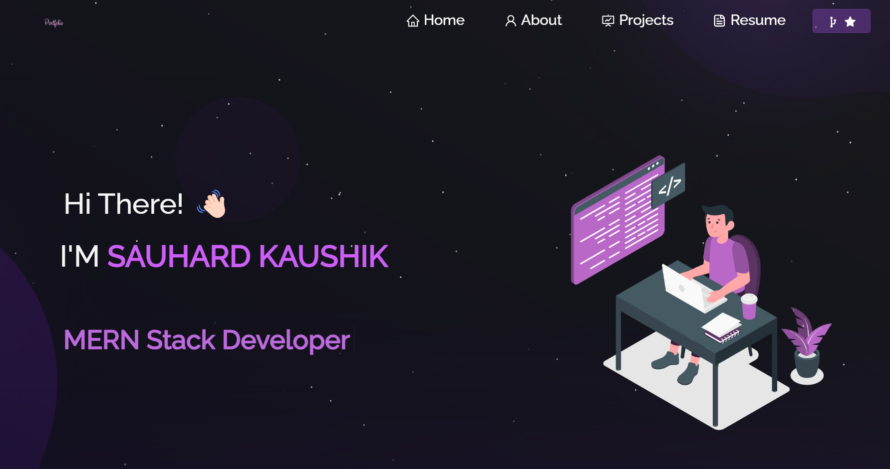

# 🌟 My Portfolio Website  

Welcome to my portfolio website! This project showcases my journey as a developer, my skills, and the projects I’ve worked on. Feel free to explore and connect with me. 🚀  

---

## 📸 Screenshots  

### **Home Page**  
  

### **Projects Section**  
  

### **Contact Section**  
  

---

## 🔗 Deployment  

Visit the live website here: [My Portfolio](https://your-deployment-link.vercel.app/)  

---

## 🛠️ Features  

- **Responsive Design:** Works seamlessly across all devices.  
- **Dynamic Projects Section:** Showcasing my best work.  
- **Interactive Contact Form:** Reach out to me directly.  
- **Modern Tech Stack:** Built using React.js, styled-components, and hosted on Vercel.  

---

## ⚙️ Tech Stack  

- **Frontend:** React.js, HTML5, CSS3, JavaScript  
- **Backend (if any):** Node.js, Express.js  
- **Deployment:** Vercel  

---

## 🚀 Getting Started  

### **1. Clone the Repository**  
```bash  
git clone https://github.com/your-username/portfolio-website.git  
cd portfolio-website  
